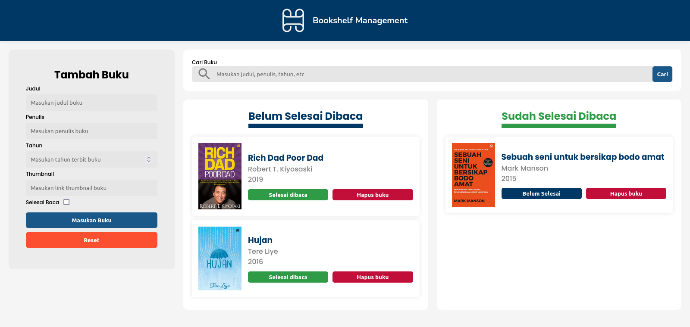

<!-- generate readme -->

# Bookshelf Management Web App

## Description

This web app is submission task from Dicoding Indonesia. This web app allows users to manage their bookshelves, including adding, removing, and updating books and store them in local storage.

## Notes

This web app is built using vanilla javascript, and it is not using any frontend framework or library except [Sweetalert](https://sweetalert2.github.io/). The Fullstack version of this web app will be built soon.

## Screenshots

